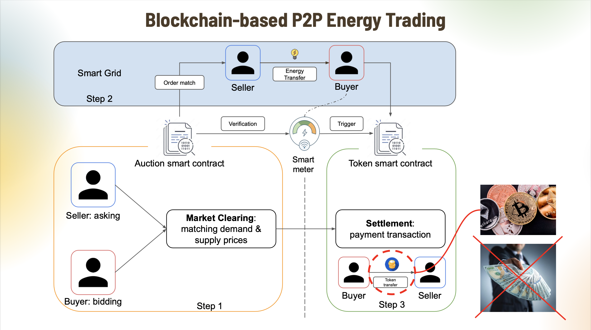
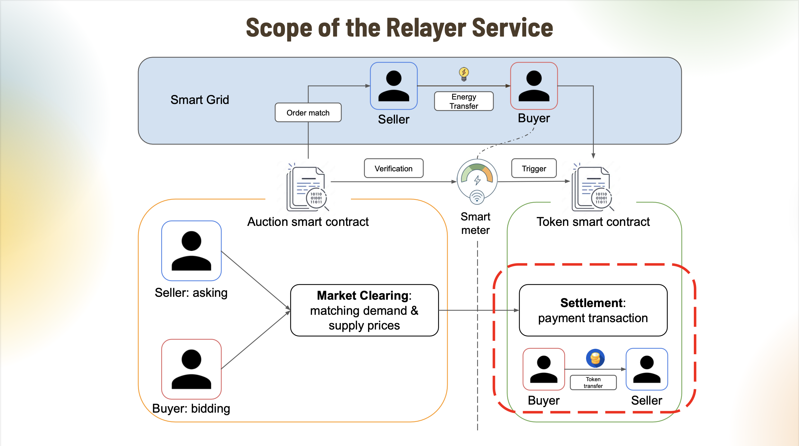
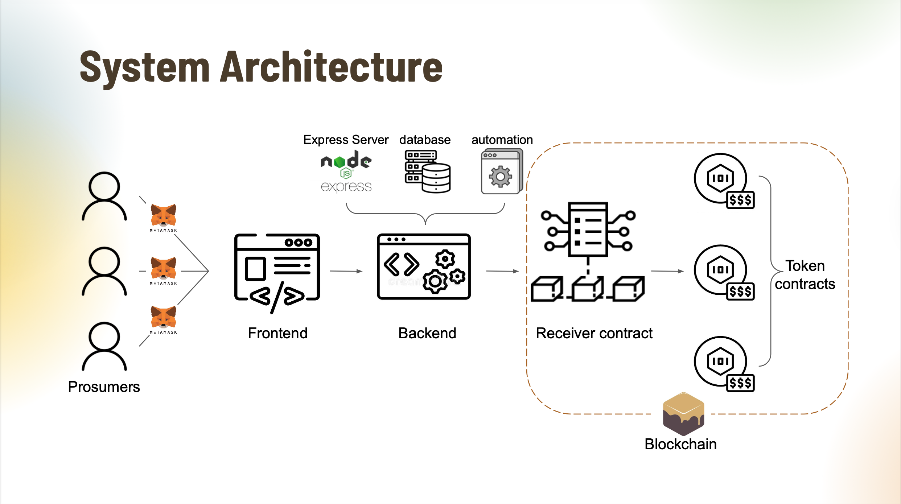
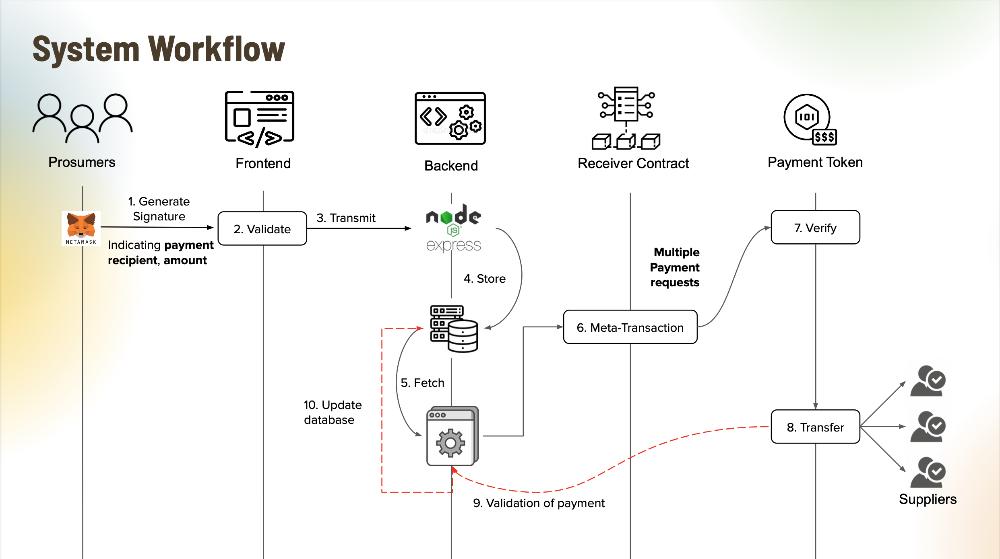

# NTU EEE Final Year Project: #

# Blockchain-based Relayer Services: Batching and Submitting Multiple Energy Transactions in a Meta-Transaction #

Submitted by: Ma Siteng

Supervisor: [Prof. Gooi Hoay Beng](https://blogs.ntu.edu.sg/gooihoaybeng/)

Co-supervisor: [Dr. Yang Jiawei](https://www.linkedin.com/in/jiawei-yang-clyde/?originalSubdomain=sg)

Examiner: [Prof. Amer Mohammad Yusuf Mohammad Ghias](https://www.ntu.edu.sg/erian/about-us/our-people/cluster-directors/amer-mohammad-yusuf-mohammad-ghias)

**Peer-to-peer energy trading** has become increasingly popular with the growth of **smart grids** and distributed energy resources. **Blockchain** provides a reliable foundation for such systems by enabling transparent, traceable, and verifiable transactions.

However, despite being permissionless, public blockchains require users to pay transaction fees (**“gas fees”**) using native tokens. This creates significant onboarding barriers for users without prior blockchain experience, including participants in blockchain-based peer-to-peer energy trading systems.

Even when private or consortium blockchains are used to avoid gas fees, **transaction efficiency** remains a challenge.

To address these issues, this project presents a **full-stack relayer service** designed using **Solidity smart contracts**, **web3.js**, **Node.js**, and **SQL Database**, which enables prosumers to initiate blockchain transactions by simply generating signatures in EIP712 standard without paying **gas fees**, and enhances efficiency by consolidating multiple payment requests into a **single transaction**. Prosumers submit transaction requests to the relayer, which executes the transactions on their behalf.

[Summary slides of the project](https://drive.google.com/file/d/1hfzqZFeBl6BoNYDJP7v6q3a11KCKbR0S/view?usp=sharing)

[Video demo of the relayer service](https://drive.google.com/file/d/1vSWy2nCm1t7VEQ8eyd9dYdiDQNnsMuFP/view?usp=sharing)

[Detailed report of the project](https://drive.google.com/file/d/1xstqeqJWfD6j4ywhnFxIZ-UKc-h9wjh_/view?usp=sharing)

**Blockchain-based P2P Energy Trading:**

**Scope of the Relayer Service**

**Relayer Service Architecture:**

**Relayer Service Workflow:**

